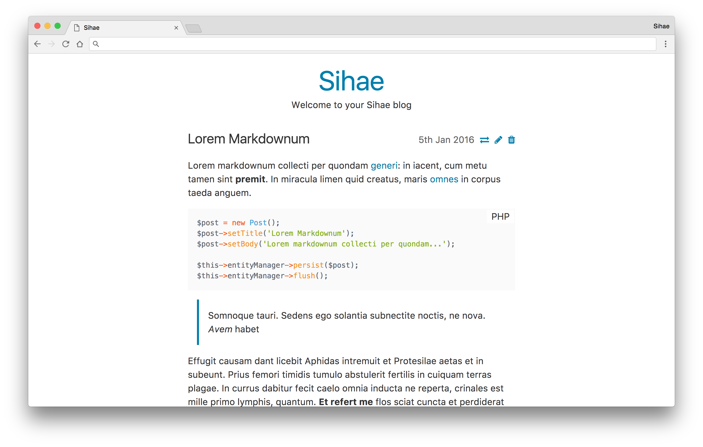

# Sihae [](https://travis-ci.org/imjoehaines/sihae) [](https://styleci.io/repos/42362618)

Sihae is a PHP 7.3+ blog engine built with Slim Framework and Doctrine ORM.

[](https://raw.githubusercontent.com/imjoehaines/sihae/master/screenshot.png)

## Features

- Publish blog posts
- Create static pages
- Markdown formatting ([CommonMark](http://commonmark.org/) via [league/commonmark](https://github.com/thephpleague/commonmark))
- Syntax highlighting (via [Prism.js](http://prismjs.com/))
- Tag posts and explore all posts by their tag(s)
- Archive list of all posts grouped by year

## Requirements

- PHP 7.3+
- MySQL or SQLite

## Setup

```sh
$ composer install
$ cp .env.example .env
# configure .env with database connection details
# create a database matching the "DB_NAME" in your .env
$ php vendor/bin/doctrine-migrations migrations:migrate
```

## Deploying

```sh
$ git fetch
$ git rebase
$ composer install --no-dev --no-suggest --optimize-autoloader
$ php vendor/bin/doctrine-migrations migrations:migrate
$ rm data/cache/router.php
```

## Configuration

All configuration is done in the `.env` file at the root of the project. It contains the following options:

- `DB_DRIVER` &mdash; choose which database to use, possible options are:
  - `pdo_mysql` to use MySQL
  - `pdo_sqlite` to use SQLite
- `DB_PATH` &mdash; the path to store the database; this **must** be an absolute path! This is only required if `DB_DRIVER` is set to `pdo_sqlite`.
- `DB_HOST` &mdash; the host to connect to the database on. This is only required if `DB_DRIVER` is set to `pdo_mysql`
- `DB_NAME` &mdash; the name of the database to use. This is only required if `DB_DRIVER` is set to `pdo_mysql`
- `DB_USER` &mdash; the user to connect to the database with. This is only required if `DB_DRIVER` is set to `pdo_mysql`
- `DB_PASSWORD` &mdash; the password to use for the `DB_USER`. This is only required if `DB_DRIVER` is set to `pdo_mysql`
- `APPLICATION_ENV` &mdash; the environment the application is running in. Locally this should be `development` and should be `production` when deployed
- `SIHAE_TITLE` &mdash; the title of your blog
- `SIHAE_SUMMARY` &mdash; the summary (line below the title) of your blog
- `ENABLE_REGISTRATION` &mdash; whether to allow users to be registered. This should be turned off after the you have registered your initial user

## Custom Themes

Creating a custom theme is super easy; Sihae will try to load template files from `templates/theme` before falling back to the root of `templates`. This means you can replace any template by creating a file with the same name inside `templates/theme`. For example, you can create a custom 404 page by creating `templates/theme/404.phtml`.

The `templates/theme` directory is ignored by git in the Sihae repository so it won't be overwritten in future versions.

Be sure to read the [Plates](http://platesphp.com/) documentation for details on how to create templates.

If you need to include images, CSS or JavaScript in your theme, there is a `public/theme` directory to store any assets your theme requires. This is also ignored by git.
