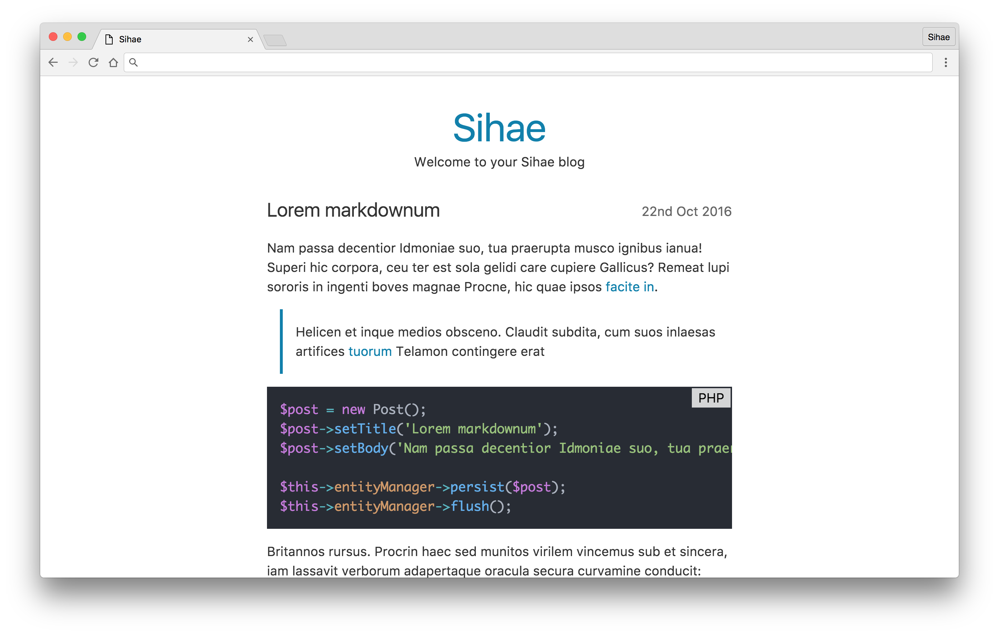

# Sihae  

## Setup
- `composer install`
- `cp .env.example .env`
- `php vendor/bin/doctrine orm:schema-tool:create`
- `php vendor/bin/doctrine-migrations migrations:migrate`

## Deploying
- `composer install --no-dev`
- `php vendor/bin/doctrine-migrations migrations:migrate`
- `rm data/cache/router.php`
